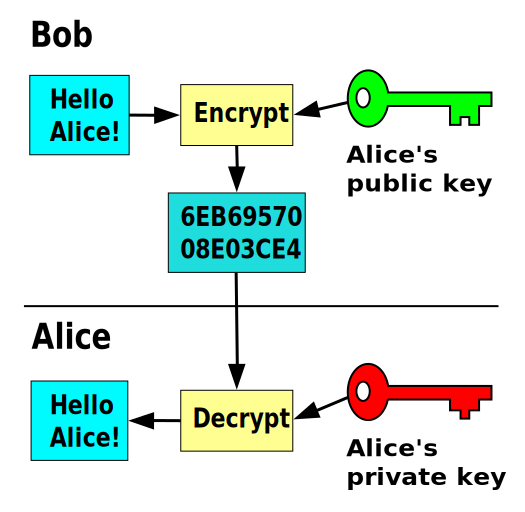
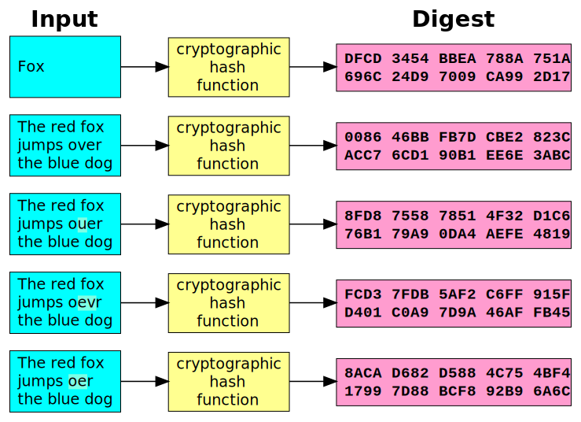

# Information Security

UUG Spring 2023

---

"The three golden rules to ensure computer security are: do not own a computer; do not power it on; and do not use it."
— Robert Morris

---

## CIA Triad

- Confidentiality
- Integrity
- Availability

---

## Confidentiality

- Data

  - Assures that private or confidential information is not made available or disclosed to unauthorized individuals

- Privacy

  - Assures that individuals control or influence what information related to them may be collected and stored and by whom and to whom that information may be disclosed

---

## Integrity

- Data

  - Assures that information and programs are changed only in a specified and authorized manner

- System

  - Assures that a system performs its intended function in an unimpaired manner, free from deliberate or inadvertent unauthorized manipulation of the system

---

## Availability

- Assures that systems work promptly and service is not denied to users

---

## Which Aspect of the CIA Triad is Most Important?

---

## Additional CIA Triad Concepts

- Authenticity

  - The property of being genuine and being able to be verified and trusted; confidence in the validity of a transmission, a message, or message originator

- Accountability

  - The security goal that generates the requirement for actions of an entity to be traced uniquely to that entity. This supports non-repudiation, deterrence, fault isolation, intrusion detection and prevention, and after-action recovery and legal action.

---

## Kerckhoffs's principle

- Security must reside entirely in the secret key

- Assume all other information is known by the attacker

- This includes the:
  - key-space (128-bit, 256-bit)
  - algorithm (AES, RSA, ECC)
  - hardware (Enigma)

---

## Types of Ciphers

- Block

- Stream

---

## Types of Encryption

- Symmetric (one key)

- Asymmetric (two keys)

---

## Symmetric Encryption

---

## Advanced Encryption Standard (AES)

---

## Asymmetric Encryption

---

## Rivest-Shamir-Adleman (RSA)

---

## Elliptic-Curve Cryptography (ECC)

---

## Diffie-Hellman (DH)

---

## Hashing

---

## Password cracking

---

## References (1 of 2)

- Stallings, William, and Lawrie Brown. Computer Security: Principles and Practice. 4th ed., Pearson, 2017.

- Wikipedia contributors. "Symmetric-key algorithm." Wikipedia, The Free Encyclopedia. Wikipedia, The Free Encyclopedia, 29 Mar. 2023. Web. 5 Apr. 2023.

---

## References (2 of 2)

- Wikipedia contributors. "Public-key cryptography." Wikipedia, The Free Encyclopedia. Wikipedia, The Free Encyclopedia, 22 Mar. 2023. Web. 5 Apr. 2023.

- Wikipedia contributors. "Cryptographic hash function." Wikipedia, The Free Encyclopedia. Wikipedia, The Free Encyclopedia, 9 Mar. 2023. Web. 5 Apr. 2023.
