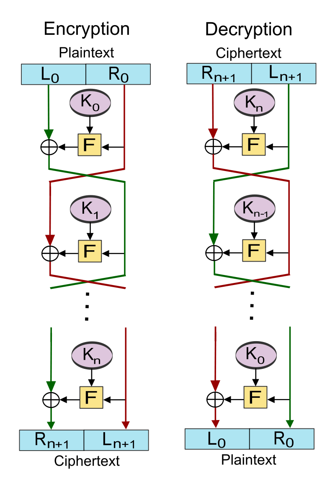
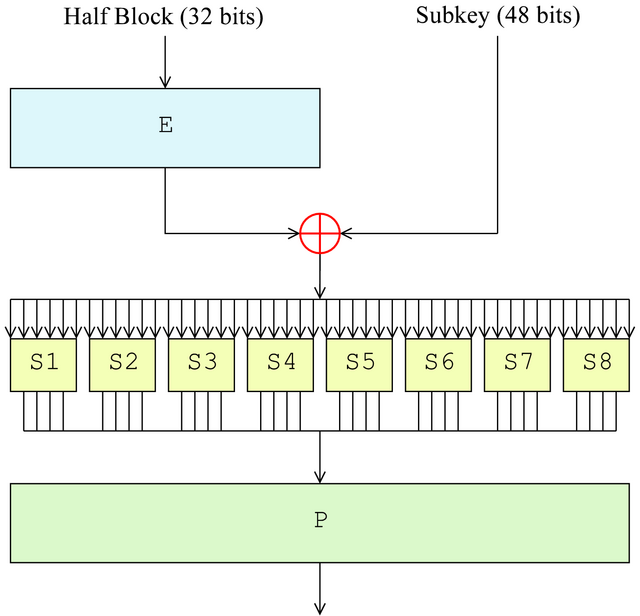
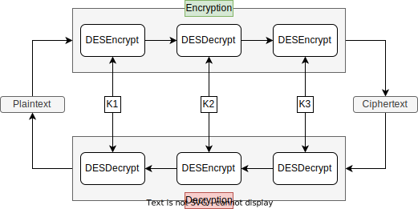
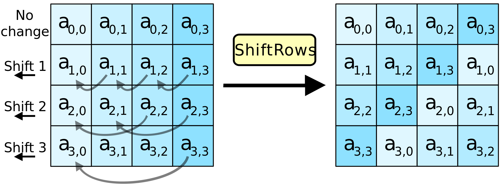
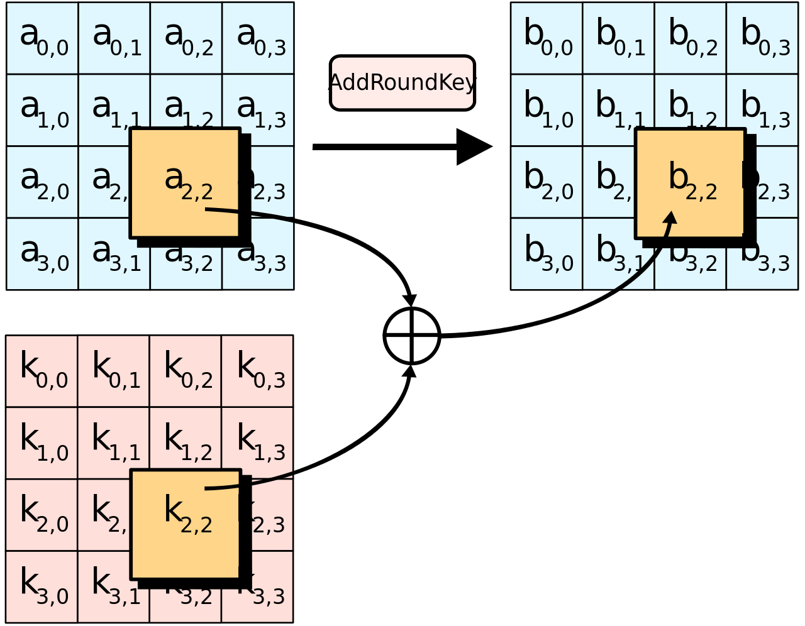

# Information Security

UUG Spring 2023

---

NOTE: Did not include key expansion steps/algorithms

---

"The three golden rules to ensure computer security are: do not own a computer; do not power it on; and do not use it."
— Robert Morris

---

## CIA Triad

- Confidentiality
- Integrity
- Availability

---

## Confidentiality

- Data

  - Assures that private or confidential information is not made available or disclosed to unauthorized individuals

- Privacy

  - Assures that individuals control or influence what information related to them may be collected and stored and by whom and to whom that information may be disclosed

---

## Integrity

- Data

  - Assures that information and programs are changed only in a specified and authorized manner

- System

  - Assures that a system performs its intended function in an unimpaired manner, free from deliberate or inadvertent unauthorized manipulation of the system

---

## Availability

- Assures that systems work promptly and service is not denied to users

---

## Which Aspect of the CIA Triad is Most Important?

---

## Additional CIA Triad Concepts

- Authenticity

  - The property of being genuine and being able to be verified and trusted; confidence in the validity of a transmission, a message, or message originator

- Accountability

  - The security goal that generates the requirement for actions of an entity to be traced uniquely to that entity. This supports non-repudiation, deterrence, fault isolation, intrusion detection and prevention, and after-action recovery and legal action.

---

## Cryptography Concepts

- Plaintext

  - The item we plan on encrypting. Human-readable.

- Key

  - A secret.

- Ciphertext

  - The output of encryption. Not human-readable.

- Cleartext

  - The output of decryption (same as the input plaintext).

---

## Kerckhoffs's principle

- Security must reside entirely in the secret key

- Assume all other information is known by the attacker

- This includes the:
  - key-space (128-bit, 256-bit)
  - algorithm (AES, RSA, ECC)
  - hardware (Enigma)

---

## Types of Ciphers

- Block

  - Message is partitioned into fixed-size blocks (typically 64 or 128-bits)

    - DES, AES, RSA

- Stream

  - Encrypts a digital data stream one bit or one byte at a time.

    - RC4, OTP (One-time pad)

---

## "Perfect" Encryption - One-Time Pad (OTP)

- Major rules of OTP:
  - Key must be the same size as the message
  - Key must be truly random
  - Keys must never be reused

---

## One-Time Pad Encryption

---

## One-Time Pad Decryption

---

## Is One-Time Pad practical to implement?

---

## Types of Encryption

| Symmetric                     | Asymmetric                                                       |
| ----------------------------- | ---------------------------------------------------------------- |
| Single key                    | Two linked/related keys                                          |
| Fast                          | Slow                                                             |
| Good for large data transfers | Good for small data transfers                                    |
| Only provides confidentiality | Can provide confidentiality, authentication, and non-repudiation |

---

## Symmetric Encryption

---

## Asymmetric Encryption

---

## Feistel Cipher

- Created by German physicist Horst Feistel and patented the early 1970's
- The Feistel Cipher is a design model (template) that is used to create different block ciphers.
  - Blowfish, DES, RC5, Twofish

---

## How the Feistel Cipher Works

---

## Data Encryption Standard

- A symmetric-key algorithm standardized in 1977
- Incorporates 16 Feistel Cipher rounds
- Has a block size of 64-bits
- Has a key size of 56-bits
  - Purposely neutered by the NSA to make brute-force attacks easier

---

## How the Data Encryption Standard Works

- Expansion: Function that takes 32-bit block increased to 48-bits
- Key mixing: XOR operation with the subkey
- Substitution: Lookup table
- Permutation: Bit shuffling

---

## Triple DES (3DES)

- Published in 1981
- Incorporates 48 Feistel Cipher rounds
- Has a block size of 64-bits
- Has a key size of 168-bits (three 56-bit keys)
- Officially deprecated by NIST at the end of 2023

---

## Advanced Encryption Standard (AES)

- Published in 1998 by Joan Daemen and Vincent Rijmen under the name Rijndael
- Selected by NIST in 2001 to replace DES

|         | Key length (bits) | Block size (bits) | # of Rounds |
| ------- | ----------------- | ----------------- | ----------- |
| AES-128 | 128               | 128               | 10          |
| AES-192 | 192               | 128               | 12          |
| AES-256 | 256               | 128               | 14          |

---

## How AES works (1 of 2)

---

## How AES works (2 of 2)

- SubBytes
- ShiftRows
- MixColumns
- AddRoundKey

---

## How AES works - SubBytes

- Byte-wise table lookup

---

## How AES works - ShiftRows

---

## How AES works - MixColumns

- Shuffles bits using special matrix multiplication
  - Uses polynomials, XOR, and modulo

---

## How AES works - AddRoundKey

---

## Rivest-Shamir-Adleman (RSA)

- An asymmetric-key algorithm published in 1977 by Ron Rivest, Adi Shamir, and Leonard Adleman
- Relies on the difficulty of factoring the product of two large prime numbers
- Common key lengths in RSA
  - 1024, 2048, 3072, 7680, 15360

---

## How RSA Works (1 of 2)

- p, q : chosen random prime integers (private)
- n : product of p and q, modulus for the public/private keys (public)
- Φ(n) : (Phi of n) Euler totient
- e : chosen integer that is (public):
  - greater than one and less than the totient
  - co-prime to the totient
  - shares no common factors with the totient
- d : calculated multiplicative inverse mod the totient (private)

---

## How RSA Works (2 of 2)

- Public key

  - {e, n}

- Private key
  - {d, n}

---

## RSA Example (1 of 3)

- p = 5, q = 7

- n = 5 × 7 = 35

- Φ(n) = (5 - 1) × (7 - 1) = 4 × 6 = 24

- e = 1 < 5 < 24

  - can check if co-prime using Euclid's Algorithm (GCD)

- d = 5⁻¹ ((mod 24)) = 5
  - can solve thus using Extended Euclid's Algorithm (XGCD)

---

## RSA Example (2 of 3)

- Public Key: {5, 35}

- plaintext (M): 23

  - ciphertext (C) = Mᵉ mod n

- C = 23⁵ mod 35 = 6436343 mod 35 = 18

---

## RSA Example (3 of 3)

- Private Key: {5, 35}

- ciphertext (C): 18

  - cleartext (M) = Cᵈ mod n

- M = 18⁵ mod 35 = 1889568 mod 35 = 23

---

## Elliptic-Curve Cryptography (ECC)

- An asymmetric-key cryptography approach independently suggested by Neal Koblitz and Victor S. Miller in 1985.
- Relies on the difficulty of finding specific points on the elliptic curve y² = x³ + ax + b
- Elliptic-curve calculations are more computationally demanding allowing keys to be smaller than the equivalent RSA counterparts

---

## How ECC Works

---

more on ECC

---

## Comparison of Symmetric and Asymmetric Algorithms

---

## Quantum Threats

---

---

## Hashing

---

## Password cracking

---

## References (1 of 5)

- Stallings, William, and Lawrie Brown. Computer Security: Principles and Practice. 4th ed., Pearson, 2017.

- Wikipedia contributors. "Symmetric-key algorithm." Wikipedia, The Free Encyclopedia. Wikipedia, The Free Encyclopedia, 29 Mar. 2023. Web. 5 Apr. 2023.

---

## References (2 of 5)

- Wikipedia contributors. "Public-key cryptography." Wikipedia, The Free Encyclopedia. Wikipedia, The Free Encyclopedia, 22 Mar. 2023. Web. 5 Apr. 2023.

- Wikipedia contributors. "Cryptographic hash function." Wikipedia, The Free Encyclopedia. Wikipedia, The Free Encyclopedia, 9 Mar. 2023. Web. 5 Apr. 2023.

---

## References (3 of 5)

- Adetunji, Daniel. “Symmetric and Asymmetric Key Encryption – Explained in Plain English.” FreeCodeCamp.org, FreeCodeCamp.org, 5 Apr. 2023, <https://www.freecodecamp.org/news/encryption-explained-in-plain-english/>.

- Wikipedia contributors. "Feistel cipher." Wikipedia, The Free Encyclopedia. Wikipedia, The Free Encyclopedia, 31 Jul. 2022. Web. 10 Apr. 2023.

---

## References (4 of 5)

- Wikipedia contributors. "Data Encryption Standard." Wikipedia, The Free Encyclopedia. Wikipedia, The Free Encyclopedia, 30 Mar. 2023. Web. 10 Apr. 2023.

- Wikipedia contributors. "Triple DES." Wikipedia, The Free Encyclopedia. Wikipedia, The Free Encyclopedia, 15 Mar. 2023. Web. 10 Apr. 2023.

- Stallings, William. Cryptography and Network Security. 7th ed., Pearson, 2016.

---

## References (5 of 5)

- Wikipedia contributors. "Advanced Encryption Standard." Wikipedia, The Free Encyclopedia. Wikipedia, The Free Encyclopedia, 9 Mar. 2023. Web. 11 Apr. 2023.

- Wikipedia contributors. "RSA (cryptosystem)." Wikipedia, The Free Encyclopedia. Wikipedia, The Free Encyclopedia, 7 Apr. 2023. Web. 11 Apr. 2023.
